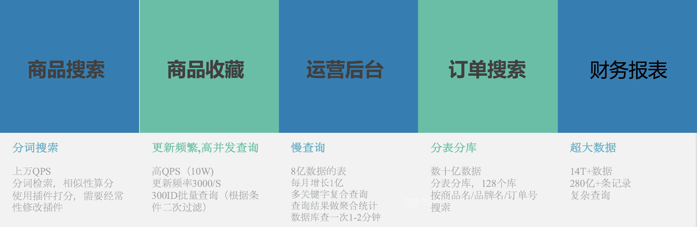

概述
==

在深入了解前，请官人先思考以下问题：

*   mysql能满足你们吗？
*   redis能满足你们吗？  
    

ok，既然它们不能满足你们，也不能说明我们就行。

pallas平台的诞生初衷主要为了解决以下几个典型的检索问题：

如果你也有与上面业务团队有相似的痛点，那我们继续。

当然如果你有其它大胆的想法，也是可以沟通的；虽然我们不能为用es而用es，但它可能真的是你当前唯一方案。

**注意：**

限制
==

延时毛刺
----

ES是基于jvm的应用，当面对突发性高流量，会有数据未预热、gc停顿等问题，难免会有超时毛刺，但也是瞬间的问题，整体还是能保持99.99%的可用性。

如果对毛刺有非常苛刻的要求，我们就需要再聊聊怎么优化，例如读写分离避免频繁的段合并与页置换等等。

准实时
---

数据库实时更新的数据通过rdp以消息的形式经消费后写到es，这里面最好的情况也有1-3秒的延时，如果要求非常实时的同步查询，我们就不太适合你。

自检
==

当你决定打死也要用pallas后，下面是我们平台的一些约束条件，毕竟行有行规。

数据源
---

pallas支持数据源为vms、mysql(单表、多库多表)、spark/hive的数据。

### mysql

对于mysql数据源，pallas会生成三个同步数据作业：

*   全量作业：一次性作业，手动执行，将db数据全量同步到es去；
*   增量作业：通过rdp/vdp将db的更新实时更新到es；
*   对账作业：每3天一次，对数据进行补缺删多，一切以db的数据为准；

**增量数据(从db->es)会有一定的延时**，最快也要1s+，为了权衡读的性能，会尽可能延时进行批量写，例如180s。

约束：

*   全局唯一id，bigint类型，自增最好，不自增需要说明；                                     (pallas用于迭代数据进es)
*   数据库维护的update_time；                                                                               (pallas用于对账数据)
*   接入rdp数据库版本要求>=5.7；                                                                          (pallas用户增量更新数据)
*   **多库多表**要求表结构一致；                                                                                 (对于es是一份数据)

### vms

vms数据源只会有一个消息作业，有消息就消费进es。

约束：

*   数据无法对账，有丢消息的可能；业务团队需要自行保证数据的完整性；

### spark/hive

spark/hive的数据通过es的插件进行同步，需在spark/hive的启动添加对应的jar包。

约束：

*   数据无法对账，有丢消息的可能；业务团队需要自行保证数据的完整性；

  

调用
--

java应用的话，pallas提供sdk供业务方接入，底层协议为http，业务方可再封装成osp服务。

通过我们的sdk能以原生的es访问方式使用，像常用的search/bulk/index/scroll。

理论上，对es数据的

*   写：写数据是由我们同步作业完成的，业务方不应该有写的操作，除非业务方维护数据的完整性一致性；
*   读：除了scroll外，全部的查询通过模板方式；

约束：

*   jdk >= 1.8；
*   通过pallas sdk接入，不能使用transportClient；(性能没太大差别)  
    

非java应用，直接通过http调用。

登堂入室
====

当上面的约束条件都达成共识后，我们就正式开始接入的流程了。

下面以mysql数据源进行举例。

你要做的|pallas要做的	
-|-								
根据pallas接入备案出封邮件，说明业务与相关需求|				
-|pallas团队收到邮件后，安排对接人(jamin.li,owen.li,yy.xu,chembo.huang)											
QA环境联调接口，见Pallas接入文档|QA环境联调接口								
申请QA环境rdp/vdpQ(增量消费作业，不需要也可不申请)| -
-|确认上线时间，pallas团队申请机器											
staging环境测试|-
申请staging环境rdp/vdpQ(增量消费作业，不需要也可不申请)|	-
-|机器到位，pallas团队与运维负责部署运维											
申请线上rdp/vdpQ|-
提供线上db信息(db,table,user,port,ip),密码需要接入Rose平台|部署线上索引，导入测试环境的mapping与模板，数据同步											
业务上线|确认没问题											
-|如有性能问题，持续压测与优化	 