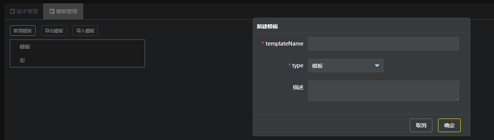

1 接入前准备
======

请详细阅读《Pallas接入规范》了解Pallas接入的适用场景及相关规范

请按备案指示发送邮件进行申请: [pallas接入备案](/pages/viewpage.action?pageId=302351958)

2 接入步骤
======

2.1 各个环境的Pallas
--------------------

#### 2.1.1 直接采用域名方式访问（2018-12-28日之后正式生效）

```
#qa环境   pallas-qa.vip.vip.com
staging环境   pallas-staging.vip.vip.com
```

同时可以在 Pallas Console GUI 右上角进行方便切换


#### 2.1.2 配置本机hosts (2018-12-28日之后不推荐采用)

```
	#qa环境
	10.197.129.11 pallas.vip.vip.com  （或绑定online hosts http://oeop.tools.vipshop.com/online_hosts/179.txt）
	 
	#staging环境
	10.199.133.253 pallas.vip.vip.com (或绑定online hosts  http://oeop.tools.vipshop.com/online_hosts/staging.txt)
```
相对应的saturn地址如下：
```
	#qa
	10.197.158.74 saturn.vip.vip.com  （或绑定online hosts http://oeop.tools.vipshop.com/online_hosts/179.txt）
	 
	#staging
	10.197.158.202  saturn.vip.vip.com  (或绑定online hosts  http://oeop.tools.vipshop.com/online_hosts/staging.txt)
```
而相对应的ES IP 如下（连任何一个ES地址即可）：

**rest-api-address**
```
	QA环境：
	10.199.173.109:9200,10.199.173.124:9200,10.199.173.125:9200
	 
	staging环境：
	10.199.173.106:9200,10.199.173.107:9200,10.199.173.108:9200
```
2.2 联系Pallas团队申请集群资源
--------------------

rtx联系黄国钦(chembo.huang)，我们需要评估需求做相关容量规划

2.3 在开发环境创建索引
-------------

浏览器访问 [http://pallas.vip.vip.com/](http://pallas.vip.vip.com/)

索引管理-新增索引，输入以下信息(所属集群请根据环境选择，功能环境请选择pallas-qa，回归环境请选择pallas-staging)


	注意：pallas的索引数据支持mysql单表、mysql同构多表、vms消息。

	当是mysql数据源时，一定要配置db信息，也可以通过txt导入，文本格式见提示。
	当是vms消息源时，把数据源删掉即可（红色减号），监听的Q在版本配置里可设置。

2.4 创建索引版本
----------

索引管理，找到刚刚创建的索引，点击【管理】，找到新增索引版本，如果是mysql数据源，看到如下图：


如果是vms数据源，如下图：


编辑索引相关的配置信息，具体解释如下：
```
	分片数量：索引的分片数量
	
	复制数据：索引的复制数量
	
	VDP QUEUE：数据表对应的vdp/rdp queue（需先确保待接入的数据表已经接入VDP，如不清楚请rtx戴翔同学; rdp 请咨询汤锦平同学）
	
	Routing Key：分片字段
	
	ID列： 唯一键字段
	
	Update Time列：更新时间字段
	
	只导局部字段：返回结果里是否只包含mapping配置的字段
	
	是否vdp：如果对接的是rdp请选择OFF
	
	导数据前先统计区间数量：如果id的位数超级大且稀疏，比如最大千亿万亿级，但总记录数几十万，这种情况请选择ON。
```
```
	VDP vs RDP
	
	vdp是一个表写到一个channel， 然后将queue绑定到表的channel，即通过queue可以消费表级别的变动；rdp是一个数据库实例写到一个channel，再将queue绑定一个channel，通过queue可以消费数据库级别的变动；

	两者queue的消费均使用vms-client。
```	
所以**如果对接rdp，且在pallas中的多个索引的数据源为同一个数据库实例的不同表，则需要将rdp的channel生成对应数量的queue来分别绑定到不同的索引上**。
```	
	比如：索引1的数据源为DB1的table1，索引2的数据源为DB1的table2， 则需要将rdp对应DB1的channel生成2条queue， queue1和queue2， 分别配置到索引1和索引2中，pallas会将不属于该索引的变动丢弃掉。
```
VMS数据源的需要手动添加mapping字段。

2.4 开启版本同步
----------


2.5 同步数据
--------

同步版本后会在saturn.vip.vip.com上创建该索引的三个作业，其中vms数据源的只有最后一个作业

*   {index\_name}\_{version\_id}\_full 全量同步作业，需要手工触发执行
*   {index\_name}\_{version\_id}\_checking 对账作业，每三天零晨2点执行一次
*   {index\_name}\_{version\_id}\_vdp 实时vdp更新作业，有vdp消息就会触发

添加host指向staging环境的saturn,建议使用online hosts

```
	#qa
	10.197.158.74 saturn.vip.vip.com  （或绑定online hosts http://oeop.tools.vipshop.com/online_hosts/179.txt）
	 
	#staging
	10.197.158.202  saturn.vip.vip.com  (或绑定online hosts  http://oeop.tools.vipshop.com/online_hosts/staging.txt)
```
访问saturn.vip.vip.com，左边域输入框过滤vip.job.pallas即可找到以上三个作业，点击{index\_name}\_{version\_id}\_full作业进去点击立即执行一次，即可触发全量同步数据，同步完成后点击{index\_name}\_{version\_id}\_vdp**启用增量作业(默认是禁用状态，必须手动启用，否则将无法消费)**。

如果重建版本，**要将之前的版本停止同步，或者手动停掉saturn上旧版本的vdp作业，或者不同版本配置不同的queue**，否则同一个queue的消息可能被旧版本的消息作业消费掉导致新版本数据不同步。

2.6 编辑模板
--------

索引管理，找到刚刚创建的索引，点击【管理】，找到模板管理，新增模板：



templateName： 模板ID（数字字符串和下列线）

类型： 可选择模板或者宏，宏不可以直接使用，只能被模板引用；模板可直接用于检索

模板使用mustache语言，简单教程见：[https://www.cnblogs.com/DF-fzh/p/5979093.html](https://www.cnblogs.com/DF-fzh/p/5979093.html)

下面是一个sql的转换例子：


调用参数示例：


有不明白的联系黎肇明、李志浩、黄国钦。

2.7 生成模板API
-----------

通过  API TAB可以看到该模板的查询API（标准的HTTP协议）


2.8 提交审核->审核通过
--------------

模板调试通过后，还需要点击提交让管理员审核才能正式生效。**非线上环境请自行审核**。详细操作如下：


提交审核


进入模板审批页面


找到自己提交的模板，点处理

2.9 JAVA代码接入
------------

java接入看 [Pallas rest客户端升级至1.1.3指引](/pages/viewpage.action?pageId=472517224)

2.10 处理Response
---------------

从2.8 上可以看到，用RestClient 获得的 Response其实就是一个普通的HTTP Response，通过 response.getEntity().getContent() 可以取得一个字符串，用这个字符串我们可以把它parse成一个JSON Object来获取一些具体的parameters；而用过Elasticsearch Transport Client 的用户当然会觉得，TransportClient是支持直接处理Java Object的 SearchResponse对象，直接处理SearchResponse 肯定是会比处理一个String要方便太多。因此如果要继续在RestClient 里处理Java Object 的SearchResponse，我们这里提供两种思路：

1.  [XContentUtils.java](/download/attachments/260278592/XContentUtils.java?version=1&modificationDate=1507789176000&api=v2) （具体GIT src在 pallas/pallas-client/src/main/java/com.vip.pallas.client.helper  ）  
  这是pallas 团队写的一个工具类，用于把REST Client 取得的HTTP Response 转换成 ES里面的SearchResponse 对象，然后对这个对象的处理就如同处理TransportClient的返回对象一样。把这个类拷贝到你的项目和pallas-aop一起用即可。  
    里面已经包含一个 for test的 main方法，大家参考着用即可，比如：  
  
      
	有一点需要留意的就是里面的逻辑大部分是从ES 5.6 抽取而来，因此和目前的ES只能保证绝大部分是兼容的，对于普通的search 也是可以应付的，但是对于拥有 aggs 的模板来说，如果希望用XContentUtils来parse SearchResponse 的话，则需要对原模板做一些调整 （具体可以看里面的介绍，或者直接联系Pallas 的开发李志浩）  
      
关于这个的更多细节可以看另外一篇wiki [Request 和Response 在ES 中的传输和解析](http://wiki.corp.vipshop.com/pages/viewpage.action?pageId=267916168)

2.  （仅推荐给非常熟悉ES的高级用户）如果觉得用XContentUtils 嫌不够高大上，其实可以直接采用 ES 5.6 的 high level REST Client, 里面已经集成了一整套走HTTP协议的SearchRequestBuilder 和SearchResponse parser了，使用起来和Transport Client是用是几乎完全一样（具体文档在[https://www.elastic.co/guide/en/elasticsearch/client/java-rest/5.6/java-rest-high-search.html](https://www.elastic.co/guide/en/elasticsearch/client/java-rest/5.6/java-rest-high-search.html) ）  
    但是由于必须引入ES5.6，因此如果你的项目已经引入pallas-aop的话，会导致ES版本冲突，因此需要自己去适配 pallas-aop，我们也会在未来直接在pallas-aop上直接继承 high level Rest Client.  
    (有更多这方面的问题可以直接咨询 pallas  开发 李志浩)